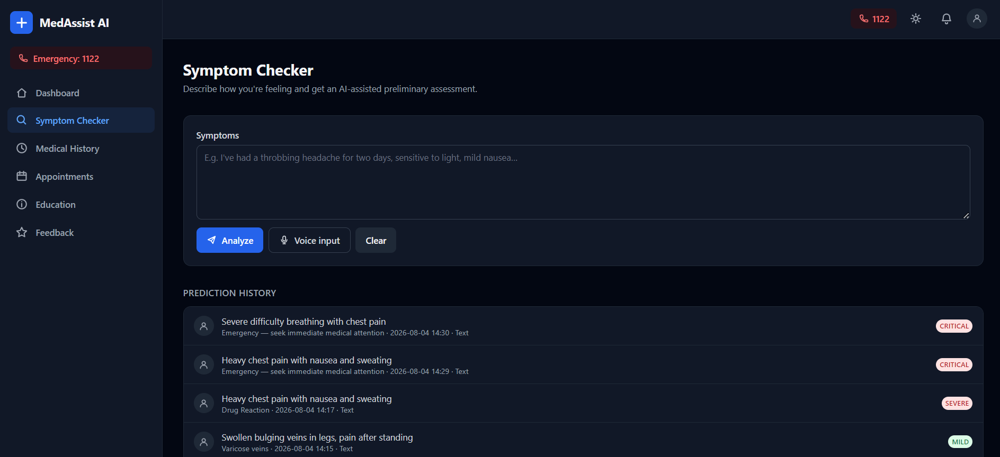
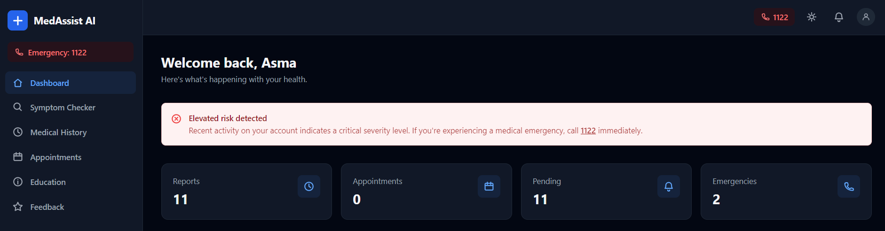
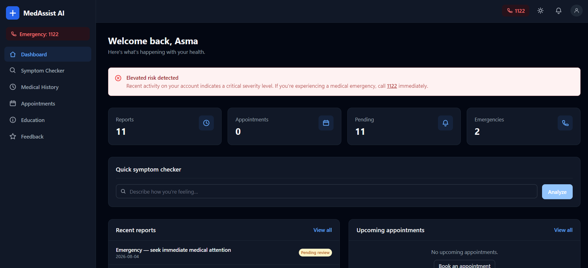
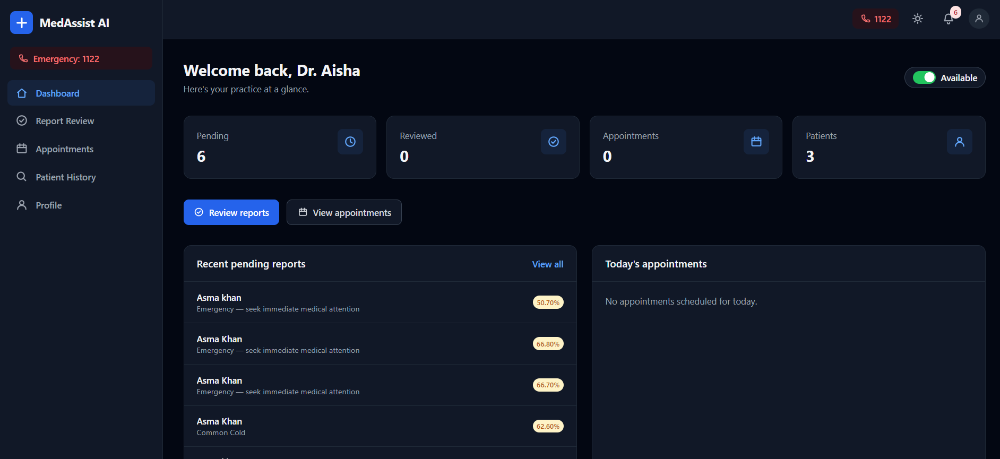
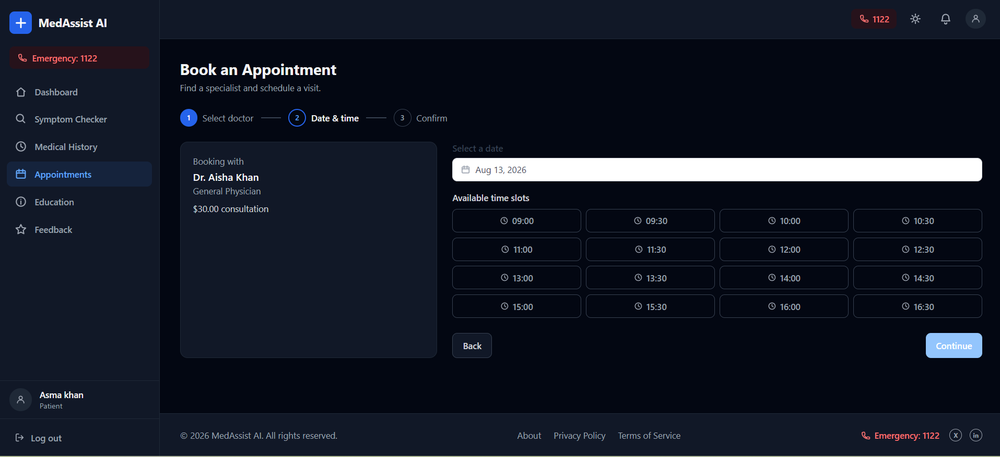
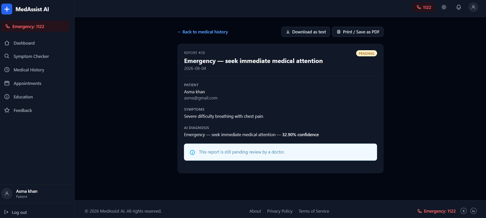
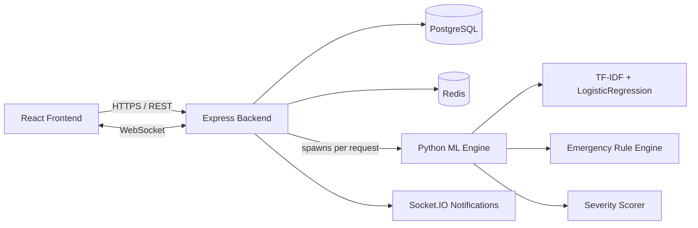

<div align="center">

# 🩺 MedAssist AI

**An AI-powered symptom checker and patient care platform** — free-text symptom
analysis, explainable disease prediction, emergency detection, and end-to-end
doctor/patient/appointment workflows.

[](#prerequisites)
[](#tech-stack)
[](#tech-stack)
[](#tech-stack)
[](#tech-stack)
[](#aiml-pipeline)
[](#license)

</div>

---

## Screenshots

<table>
  <tr>
    <td width="50%"><br/><sub align="center">AI Symptom Checker — confidence, matched symptoms &amp; top differentials</sub></td>
    <td width="50%"><br/><sub>Emergency detection banner for red-flag symptom combinations</sub></td>
  </tr>
  <tr>
    <td width="50%"><br/><sub>Patient dashboard — stats, notifications, upcoming appointments</sub></td>
    <td width="50%"><br/><sub>Doctor dashboard — availability toggle, pending reports</sub></td>
  </tr>
  <tr>
    <td width="50%"><br/><sub>Appointment booking — specialist → date/time → confirm</sub></td>
    <td width="50%"><br/><sub>Doctor report review — diagnosis, notes &amp; prescription</sub></td>
  </tr>
</table>


---

## Overview

MedAssist AI is a full-stack medical assistant application that lets patients
describe symptoms in plain text (or voice), get an AI-assisted preliminary
diagnosis with a transparent explanation of *why*, and when the symptoms
warrant it and get routed straight to an emergency warning instead of a
disease guess. Patients can then book appointments with the recommended
specialist, and doctors get a dashboard to review and act on AI-generated
reports.

It's built as a real, working system rather than a demo: a calibrated,
leakage-free-validated ML pipeline, rule-based emergency detection tuned
against real clinical presentations (and documented false-positive/negative
cases it was specifically fixed to avoid), role-based auth, rate limiting,
and a Dockerized deployment path with CI/CD.

A full technical audit architecture, every API route, the ML pipeline's
design decisions, a confusion-matrix-driven analysis of model weak spots,
and honestly-documented known limitations lives in
[`PROJECT_REPORT.md`](PROJECT_REPORT.md).

---

## Key Features

- 🔍 **Free-text AI symptom analysis** — describe symptoms naturally (typed or spoken); no checkbox forms.
- 🧠 **Explainable predictions** — every diagnosis shows a checkmarked list of matched symptoms, a calibrated confidence score, and the top-3 differential diagnoses with the exact terms that drove each one.
- 🚨 **Independent emergency detection** — a rule-based, disease-specific red-flag system (separate from the ML classifier) that overrides the diagnosis entirely when a symptom combination is emergency-consistent (e.g. chest pain + left-arm pain, chest pain + sweating + nausea).
- 📊 **Severity scoring** — MILD → MODERATE → SEVERE → CRITICAL, from a weighted, synonym-aware symptom matcher.
- 👨‍⚕️ **Smart doctor recommendation** — maps the predicted condition (or a keyword fallback) to a real, bookable specialist.
- 📅 **Appointment booking** — specialist → date/time → confirmation, with slot-conflict checking.
- 🗂️ **Doctor report review workflow** — diagnosis confirmation, notes, and prescriptions on AI-generated reports.
- 📈 **Patient medical history** — aggregated reports, appointments, and analysis history in one place.
- 🔔 **Real-time notifications** via Socket.IO.
- 📚 **Health education articles** and a **feedback/rating** system.
- 🌗 **Dark/light theme** with pre-hydration flash prevention.
- 👤 **Guest mode** — try the symptom checker with zero signup.

---

## AI/ML Pipeline

| Stage | Approach |
|---|---|
| **Classification** | TF-IDF (unigrams + bigrams) → `LogisticRegression` → `CalibratedClassifierCV` (sigmoid), trained on 2,400+ deduplicated, leakage-free samples across 42 disease classes |
| **Symptom extraction** | A rule-based phrase matcher over a 131-symptom canonical vocabulary (+ hand-curated synonyms), surfaced to the user as a checkmarked "matched symptoms" list |
| **Explainability** | Per-term, per-class coefficient decomposition — shows exactly which words contributed how much to each differential, not just a black-box score |
| **Emergency detection** | A separate, weighted, disease-specific rule engine (heart attack / stroke / respiratory / other), calibrated against real clinical presentations to avoid both false positives (e.g. classic Pneumonia) and false negatives (e.g. classic ACS) |
| **Validation** | 5-fold stratified cross-validation, refit per fold to avoid vocabulary leakage; a hand-written, non-templated regression suite; a full confusion matrix to find *which specific diseases* get confused, not just an aggregate accuracy number |

**Why classical ML, not embeddings?** An experimental `all-MiniLM-L6-v2`
sentence-embedding branch was built and evaluated on the exact same
cross-validation folds as the production model. Result: statistically
indistinguishable accuracy/F1/log-loss. Since embeddings offer no accuracy
gain here, the project keeps TF-IDF + LogisticRegression in production
specifically because it supports the exact, per-term explainability above —
a capability a frozen sentence embedding doesn't give you for free. Full
methodology and numbers in [`PROJECT_REPORT.md`](PROJECT_REPORT.md).

---

## Tech Stack

**Frontend** — React 18, TypeScript, Tailwind CSS, Vite, React Router, Zustand, React Hook Form + Zod, Vitest

**Backend** — Node.js, Express, TypeScript, Socket.IO, Jest, Zod validation, JWT auth, bcrypt, Helmet, express-rate-limit

**Data layer** — PostgreSQL (live), Redis (optional caching/rate-limit backing store)

**AI/ML** — Python, scikit-learn (`TfidfVectorizer`, `LogisticRegression`, `CalibratedClassifierCV`), pandas

**DevOps** — Docker (multi-stage builds), PM2, Nginx (reverse proxy + TLS termination), GitHub Actions CI/CD

---

## Architecture



---

## Project Structure

```
medassist-ai/
├── package.json                 # Root npm workspace config
├── docker-compose.yml            # Dev stack (Postgres/Mongo/Redis/backend/frontend)
├── docker-compose.prod.yml       # Production stack (+ Nginx, TLS)
├── PROJECT_REPORT.md             # Full technical audit & design decisions
├── docs/
│   ├── screenshots/              # README screenshots — see its own README
│   └── RAG_ARCHITECTURE.md       # Experimental retrieval-augmented prototype
├── nginx/                        # Reverse proxy config (production)
├── scripts/                      # Deploy / migration scripts
└── packages/
    ├── backend/
    │   ├── src/                  # Express app: routes, controllers, services, middleware
    │   ├── ml/                   # predict.py, train_model.py, emergency.py, data/
    │   │   └── experimental/     # Sentence-Transformer comparison branch
    │   └── sql/schema.sql
    ├── frontend/
    │   └── src/                  # Pages, components, hooks, API client
    └── rag-service/               # Experimental FastAPI + ChromaDB retrieval prototype
```

---

## Getting Started

### Prerequisites

- Node.js ≥ 18 (LTS recommended) and npm ≥ 9
- Python 3.8+ (for the ML engine)
- PostgreSQL 14+ (the live data store)
- Redis (optional — the app runs fine with `REDIS_ENABLED=false`)
- Docker & Docker Compose (optional, for containerized setup)

### 1. Clone & Install

```bash
git clone https://github.com/Asmakhan427/AI-Powered-Intelligent-Medical-Diagnosis-and-Patient-Care-System.git
cd AI-Powered-Intelligent-Medical-Diagnosis-and-Patient-Care-System
npm install
```

This project uses **npm workspaces** — one `npm install` at the root resolves
dependencies for both `packages/backend` and `packages/frontend`.

### 2. Configure Environment Variables

```bash
cp .env.example .env
```

Edit `.env` and set real values, in particular `DB_*` (PostgreSQL),
`JWT_SECRET` / `JWT_REFRESH_SECRET` (use long random strings, e.g.
`openssl rand -hex 64`), and `PYTHON_EXECUTABLE` if `python` isn't on your
PATH. **Never commit your real `.env`.**

### 3. Set Up PostgreSQL

```bash
psql -U postgres -f packages/backend/sql/schema.sql
```

### 4. Install the ML Engine's Python Dependencies

```bash
cd packages/backend/ml
pip install scikit-learn pandas joblib
cd ../../..
```

### 5. Run in Development

```bash
npm run dev
```

Runs backend and frontend concurrently:

- Backend (Express + Socket.IO) → http://localhost:3000
- Frontend (Vite dev server) → http://localhost:5173

Or individually: `npm run dev:backend` / `npm run dev:frontend`

### 6. Production Build

```bash
npm run build
npm start
```

---

## Environment Variables

All variables are documented with inline comments in
[`.env.example`](.env.example) — copy it to `.env` and fill in real secrets.
Key groups: server/CORS config, PostgreSQL connection, JWT secrets, Redis
(optional), the Python/ML bridge (`PYTHON_EXECUTABLE`, `PREDICT_SCRIPT_PATH`,
model paths), and the emergency contact number shown in the emergency
banner.

---

## Training / Placing the ML Model

If you already have `disease_model.pkl` and `vectorizer.pkl`, place them in
`packages/backend/ml/`. Otherwise, train from scratch:

```bash
cd packages/backend/ml
python train_model.py
```

This reads the CSVs in `packages/backend/ml/data/`, runs leakage-free
cross-validation (printed to stdout), and writes `disease_model.pkl` +
`vectorizer.pkl` — the artifacts `predict.py` loads at inference time.

To sanity-check the pipeline against hand-written, non-templated inputs:

```bash
python tests/run_cases.py
```

---

## Running Tests

```bash
npm test                 # backend + frontend suites
npm run test:coverage    # with coverage reports
```

---

## Docker Deployment

```bash
# Development stack
docker-compose up --build

# Production stack (Postgres + Mongo + Redis + backend + frontend + Nginx)
docker compose -f docker-compose.prod.yml --env-file .env up -d --build
```

See `scripts/deploy.sh` and `.github/workflows/deploy.yml` for the full
CI/CD pipeline (test → build → push to GHCR → SSH deploy).

---

## API Overview

| Prefix | Purpose |
|---|---|
| `/api/v1/auth` | Registration, login, guest login |
| `/api/v1/ai` | Symptom analysis, doctor recommendation, health education, prediction history |
| `/api/v1/patient` | Authenticated patient's own history, reports, appointments |
| `/api/v1/doctor` | Authenticated doctor's own dashboard/report-review actions |
| `/api/v1/doctors` | Public doctor directory |
| `/api/v1/appointments` | Booking, listing, cancellation |
| `/api/v1/feedback` | Rating/comment submission |

Full endpoint-by-endpoint documentation, request/response shapes, and
verified gaps (a couple of frontend-only flows with no backend route yet)
are in [`PROJECT_REPORT.md`](PROJECT_REPORT.md#10-api-documentation).

---

## Security Features

- Helmet security headers, CORS allow-list, 4 tiered rate-limit policies
- bcrypt password hashing, JWT access/refresh tokens with rotation
- Role-based authorization (`patient` / `doctor` / `guest`) + ownership checks
- Zod input validation on every mutating endpoint
- Centralized error handling (no stack traces leaked in production)

---

## Roadmap

- Acquire real free-text training data for the structured-only disease classes
- Complete (or formally retire) the MongoDB migration
- Expand automated test coverage toward the configured 80% threshold
- Decide the fate of the experimental RAG/retrieval prototype (`packages/rag-service/`)

---

## License

MIT — see [LICENSE](LICENSE) if present, or the `license` field in
[`package.json`](package.json).

---

<div align="center">

Built by <a href="https://github.com/Asmakhan427">Asma Khan</a>

</div>
