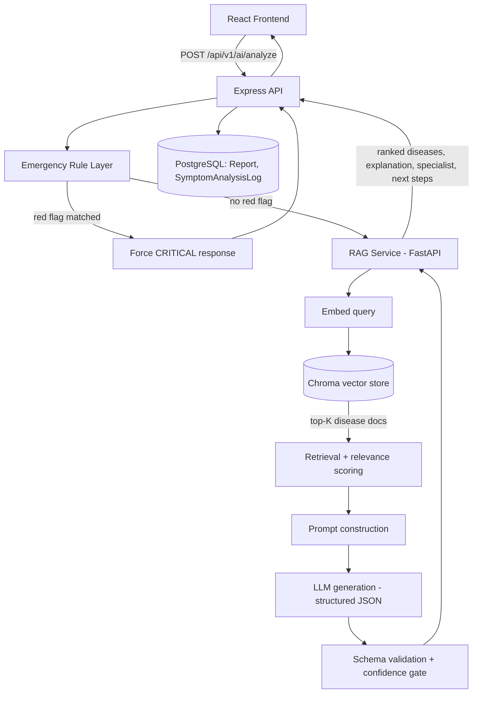

# MedAssist AI — RAG Architecture Redesign

Status: design proposal, not yet implemented. Nothing in this document has been built — it's the plan to review before any code changes.

## 0. Where this leaves the existing ML pipeline

`packages/backend/ml/` (TF-IDF + LogisticRegression, `train_model.py`/`predict.py`) is not wasted work. Its cleaned, canonical-labeled data becomes the **seed content for the RAG knowledge base**:

- `data/dataset.csv` + `data/symptom_Description.csv` + `data/symptom_precaution.csv` + `doctor_map.json` → the 42 disease documents the vector store indexes.
- The `EMERGENCY_PHRASES` list in `predict.py` → the starting point for the new rule-based emergency layer (requirement 9).
- `tests/cases.json` → doubles as a **retrieval-quality regression suite** for the new pipeline (does the right disease show up in top-k retrieved docs?), not just a classifier smoke test.

The classifier itself gets replaced, but keep it running behind a feature flag during migration (see §12) — don't delete a working fallback while the new pipeline is unproven.

## 1. Why RAG instead of classification here

The current architecture is: text → single label (argmax over a fixed class list) → dictionary lookup for doctor/precautions. Its ceiling is the training set: a disease with no examples can never be predicted, and there's no way to say "this looks like two things, here's why."

RAG changes the shape of the problem: text → retrieve the K most relevant *disease documents* from a knowledge base → an LLM reasons over that retrieved context to rank candidates, explain its reasoning, and decide whether it has enough information at all. Adding a disease to the system becomes "add a document," not "collect 50-120 new labeled examples and retrain."

The tradeoff you're taking on: an external LLM call (latency, cost, an API dependency) in exchange for open-ended disease coverage, explainability, and graceful handling of novel phrasing. Retrieval quality becomes the new bottleneck instead of classifier accuracy — a wrong prediction is now usually "the right document wasn't retrieved," which is directly debuggable and fixable by editing a document.

## 2. High-level architecture



Two services, same as today's split between Node and Python — just a different Python side:

- **Express backend** (unchanged role): auth, rate limiting, persistence, the public API contract the frontend already speaks.
- **New `rag-service`** (Python, FastAPI, long-running process): owns the embedding model, the vector store, retrieval, prompt construction, and the LLM call. Long-running because embedding/LLM clients are expensive to initialize — unlike `predict.py`, which is cheap enough to spawn per-request, this should **not** be a subprocess-per-call.

## 3. Recommended models and datasets

### Embedding model (requirement 2)

| Model | Why | Notes |
|---|---|---|
| **`pritamdeka/S-PubMedBert-MS-MARCO`** (recommended default) | PubMedBERT already fine-tuned for retrieval (trained on MS MARCO), drop-in with `sentence-transformers`, 768-dim | Best balance of domain grounding + retrieval-specific training for this use case |
| `BAAI/bge-small-en-v1.5` | General-purpose but consistently strong on retrieval benchmarks (MTEB); 384-dim, ~3x faster | Worth A/B testing against PubMedBERT — general embeddings sometimes beat domain BERT on short, casual-phrasing queries (which is what symptom input actually looks like) |
| `cambridgeltl/SapBERT-from-PubMedBERT-fulltext` | Self-alignment pretraining, excellent for linking free-text mentions to UMLS concepts | Phase 2 addition, not needed to ship v1 — use if you add symptom-level (not just disease-level) retrieval |

Avoid plain `BioBERT`/`PubMedBERT` (not the retrieval-fine-tuned variant) for embeddings directly — base BERT `[CLS]`/mean-pooled embeddings are known to cluster poorly for sentence-similarity tasks without contrastive fine-tuning; you'd be fighting the model instead of using it.

### LLM for generation (requirement 5)

The retrieved documents carry the medical facts — the LLM's job is to *reason over* them (rank, explain, decide if there's enough information), not recall facts from its own training. That reframes the choice: instruction-following and structured-output reliability matter far more than domain pretraining.

| Option | When to use |
|---|---|
| **Hosted API — Claude (Haiku/Sonnet) or GPT-4o-mini/GPT-4o** (recommended) | Best structured-JSON reliability, best safety/hedging framing out of the box, no GPU to manage. Cost is per-request but small models are inexpensive at this volume. |
| BioMistral-7B / MedGemma (self-hosted via Ollama or vLLM) | Only if you specifically need zero API cost or on-prem/offline operation. Materially weaker instruction-following than frontier hosted models — budget real time for JSON-schema retry logic and output validation (§9). Needs a GPU (even 7B models are slow on CPU for interactive latency). |

Either way: **never let the LLM be the only thing standing between a red-flag symptom and an emergency response.** That's what §8's rule layer is for — it runs first, deterministically, and its verdict can't be talked out of by the LLM.

### Knowledge base datasets (requirement 13)

1. **What's already in this repo** — `dataset.csv` (41 diseases × symptoms), `symptom_Description.csv`, `symptom_precaution.csv`, `doctor_map.json`. Already cleaned and canonically labeled (see `ml/train_model.py`'s `canonical_label_map`). This is your v1 knowledge base, for free.
2. **MedlinePlus** (nlm.nih.gov) — free, has an XML API, consumer-friendly disease descriptions and treatment info. Best next source to broaden beyond 41 diseases with real prose, not just symptom checklists.
3. **Human Phenotype Ontology (HPO)** — a structured symptom↔disease association graph. Useful once you want retrieval to reason about symptom *co-occurrence*, not just keyword/embedding overlap on a description paragraph.
4. **UMLS Metathesaurus** (free NLM license, research/education use) — canonical concept IDs; adopt when you want to normalize casual phrasing ("tummy ache") to a formal concept before retrieval, rather than relying on the embedding model to bridge that gap alone.
5. **PubMed/PMC OA abstracts** (via NCBI E-utilities) — optional deeper grounding text per disease, if descriptions need more clinical depth than MedlinePlus provides.

Skip MIMIC-III/IV for this — it's ICU clinical notes, credentialed access, and not shaped like a disease-description knowledge base. Overkill for what this app needs.

## 4. Backend folder structure (requirement 10a)

```
packages/
  rag-service/                      # NEW — Python microservice
    app/
      main.py                       # FastAPI app: /analyze, /health, /admin/reindex
      config.py                     # env-driven settings (mirrors backend/src/config/env.ts)
      schemas.py                    # pydantic request/response models
      emergency.py                  # rule-based red-flag layer
      embeddings.py                 # sentence-transformers wrapper
      vectorstore.py                # Chroma client wrapper
      retrieval.py                  # top-K retrieval + relevance scoring
      prompt.py                     # prompt template construction
      llm.py                        # LLM client abstraction (Anthropic/OpenAI/Ollama)
      pipeline.py                   # orchestrates: emergency -> retrieve -> prompt -> LLM -> validate
                                     # (imports check_emergency from backend/ml/emergency.py --
                                     #  no local emergency.py; see section 8)
    scripts/
      build_knowledge_base.py       # one-time/rebuild indexing (the "train_model.py" of this world)
    data/                           # shared with, or synced from, backend/ml/data
    chroma_db/                      # persisted vector store (gitignored)
    requirements.txt
    Dockerfile
  backend/                          # existing Express app
    src/
      services/
        rag.service.ts              # NEW — HTTP client calling rag-service (replaces python.service.ts's role)
      controllers/
        ai.controller.ts            # updated: calls rag.service instead of python.service
      config/
        env.ts                      # add RAG_SERVICE_URL, RAG_SERVICE_TIMEOUT_MS
```

`python.service.ts` and `ml/predict.py` stay in place until the migration is validated (§12) — `rag.service.ts` is additive, not a same-file rewrite.

## 5. Knowledge base document schema and indexing (requirements 3, 6)

One document per disease. This is a direct reshaping of data you already have:

```python
# rag-service/app/schemas.py
from pydantic import BaseModel

class DiseaseDocument(BaseModel):
    disease: str                # canonical label, same as ml/train_model.py's canonical form
    description: str            # from symptom_Description.csv
    symptoms: list[str]         # from dataset.csv's Symptom_1..17 columns
    precautions: list[str]      # from symptom_precaution.csv
    specialist: str             # from doctor_map.json
    embedding_text: str         # what actually gets embedded (see below)
```

```python
# rag-service/scripts/build_knowledge_base.py
"""
Builds/rebuilds the Chroma collection from the same source CSVs
ml/train_model.py already trains on. Run whenever ml/data/*.csv changes.

    python scripts/build_knowledge_base.py
"""
import sys
from pathlib import Path

import pandas as pd
import chromadb
from sentence_transformers import SentenceTransformer

# Reuse the exact canonicalization logic already validated in ml/train_model.py
# instead of re-deriving it — same join key across both systems.
sys.path.insert(0, str(Path(__file__).parent.parent.parent / "backend" / "ml"))
from train_model import canonical_label_map, parse_dataset_symptoms  # noqa: E402

DATA_DIR = Path(__file__).parent.parent.parent / "backend" / "ml" / "data"
CHROMA_DIR = Path(__file__).parent.parent / "chroma_db"
EMBEDDING_MODEL = "pritamdeka/S-PubMedBert-MS-MARCO"


def build_documents() -> list[dict]:
    dataset = pd.read_csv(DATA_DIR / "dataset.csv")
    dataset["Disease"] = dataset["Disease"].str.strip()
    normalize = canonical_label_map(dataset["Disease"].unique())

    descriptions = pd.read_csv(DATA_DIR / "symptom_Description.csv")
    desc_lookup = {
        str(r["Disease"]).strip().lower(): str(r["Description"]).strip()
        for _, r in descriptions.iterrows()
    }

    precautions_df = pd.read_csv(DATA_DIR / "symptom_precaution.csv")
    precaution_lookup = {}
    for _, row in precautions_df.iterrows():
        key = str(row["Disease"]).strip().lower()
        precaution_lookup[key] = [
            str(row[c]).strip() for c in precautions_df.columns[1:]
            if pd.notna(row[c]) and str(row[c]).strip()
        ]

    # Reuse predict.py's loader (already strips the "_comment" key) instead
    # of re-parsing doctor_map.json inline -- one place that knows this
    # file's shape, not two.
    from predict import load_doctor_map
    doctor_map = load_doctor_map()

    documents = []
    for disease, group in dataset.groupby("Disease"):
        canonical = normalize(disease)
        symptoms = sorted({
            tok.strip() for _, row in group.iterrows()
            for tok in parse_dataset_symptoms(row).split(", ") if tok.strip()
        })
        description = desc_lookup.get(canonical.lower(), "")
        precautions = precaution_lookup.get(canonical.lower(), [])
        specialist = doctor_map.get(canonical, "General Physician")

        # What gets embedded: description carries clinical framing, symptoms
        # carry the vocabulary a user's free-text query is likely to use --
        # both matter for retrieval quality.
        embedding_text = f"{canonical}. {description} Symptoms include: {', '.join(symptoms)}."

        documents.append({
            "disease": canonical,
            "description": description,
            "symptoms": symptoms,
            "precautions": precautions,
            "specialist": specialist,
            "embedding_text": embedding_text,
        })
    return documents


def main():
    documents = build_documents()
    print(f"Built {len(documents)} disease documents")

    model = SentenceTransformer(EMBEDDING_MODEL)
    embeddings = model.encode([d["embedding_text"] for d in documents], show_progress_bar=True)

    client = chromadb.PersistentClient(path=str(CHROMA_DIR))
    # Recreate on every rebuild -- this is a full reindex, not an incremental
    # upsert, same "regenerate from source CSVs" model as train_model.py.
    client.delete_collection("diseases") if "diseases" in [c.name for c in client.list_collections()] else None
    collection = client.create_collection("diseases", metadata={"embedding_model": EMBEDDING_MODEL})

    collection.add(
        ids=[d["disease"] for d in documents],
        embeddings=embeddings.tolist(),
        metadatas=[{
            "specialist": d["specialist"],
            "precautions": "|".join(d["precautions"]),
            "symptoms": "|".join(d["symptoms"]),
        } for d in documents],
        documents=[d["description"] for d in documents],
    )
    print(f"Indexed {collection.count()} documents into {CHROMA_DIR}")


if __name__ == "__main__":
    main()
```

## 6. Embedding generation (requirement 2, 10d)

```python
# rag-service/app/embeddings.py
from functools import lru_cache
from sentence_transformers import SentenceTransformer

EMBEDDING_MODEL = "pritamdeka/S-PubMedBert-MS-MARCO"

@lru_cache(maxsize=1)
def get_embedder() -> SentenceTransformer:
    # Loaded once per process, not per request -- this is the whole reason
    # rag-service is a persistent FastAPI app instead of predict.py's
    # spawn-per-request pattern (model load is ~seconds, unacceptable per call).
    return SentenceTransformer(EMBEDDING_MODEL)

def embed_query(text: str) -> list[float]:
    return get_embedder().encode(text, normalize_embeddings=True).tolist()
```

## 7. Retrieval pipeline (requirement 4, 10f)

```python
# rag-service/app/retrieval.py
from dataclasses import dataclass
import chromadb
from .embeddings import embed_query

TOP_K = 5
CHROMA_DIR = "./chroma_db"

@dataclass
class RetrievedDisease:
    disease: str
    description: str
    specialist: str
    symptoms: list[str]
    precautions: list[str]
    relevance: float          # 0-1, higher is more relevant

_client = chromadb.PersistentClient(path=CHROMA_DIR)
_collection = _client.get_collection("diseases")


def retrieve(query: str, top_k: int = TOP_K) -> list[RetrievedDisease]:
    query_embedding = embed_query(query)
    results = _collection.query(
        query_embeddings=[query_embedding],
        n_results=top_k,
        include=["metadatas", "documents", "distances"],
    )

    retrieved = []
    for i in range(len(results["ids"][0])):
        distance = results["distances"][0][i]
        # Chroma's default space is L2 on normalized embeddings, which
        # ranges roughly 0-2; map to an intuitive 0-1 "relevance" so
        # pipeline.py's confidence gate (see section 9) isn't reasoning
        # about raw distance units.
        relevance = max(0.0, 1.0 - distance / 2.0)
        meta = results["metadatas"][0][i]
        retrieved.append(RetrievedDisease(
            disease=results["ids"][0][i],
            description=results["documents"][0][i],
            specialist=meta["specialist"],
            symptoms=meta["symptoms"].split("|") if meta["symptoms"] else [],
            precautions=meta["precautions"].split("|") if meta["precautions"] else [],
            relevance=relevance,
        ))
    return retrieved
```

## 8. Emergency rule-based layer (requirement 9)

**Single source of truth, not a second implementation.** `predict.py` already has a working `EMERGENCY_PHRASES` substring-match list. The RAG pipeline needs the same capability, extended with the additional red flags you listed (left arm pain, facial drooping, slurred speech, loss of consciousness) — the wrong move is writing a second detector (a regex-based one, in an earlier draft of this doc) that has to be kept in sync with the first by hand forever. Instead, the phrase list is extracted **once** into a shared module both pipelines import, using the same substring-match technique `predict.py` already has tests against — no new detection technique, no second list to drift out of sync.

```python
# packages/backend/ml/emergency.py
"""
Shared red-flag / emergency-phrase detection. Used by both predict.py (the
classic pipeline) and the RAG pipeline's emergency layer -- one list, so the
two pipelines can't silently disagree on what counts as an emergency.
"""

EMERGENCY_PHRASES = [
    # Cardiac / respiratory
    "chest pain", "pain in chest", "chest hurts", "pain in my chest",
    "heart attack", "left arm pain", "pain in my left arm", "pain down my left arm",
    "can't breathe", "cant breathe", "cannot breathe", "difficulty breathing",
    "trouble breathing", "hard to breathe", "struggling to breathe",
    "gasping for air", "not breathing", "shortness of breath",
    # Neurological
    "stroke", "facial drooping", "face is drooping", "one side of my face",
    "slurred speech", "trouble speaking", "can't speak clearly", "seizure",
    "loss of consciousness", "passed out", "fainted", "unconscious", "unresponsive",
    # Bleeding / allergic
    "severe bleeding", "heavy bleeding", "severe allergic reaction", "anaphylaxis",
    "coughing blood", "blue lips",
    # Psychiatric
    "suicidal",
]


def check_emergency(symptoms_lower: str) -> bool:
    return any(phrase in symptoms_lower for phrase in EMERGENCY_PHRASES)
```

`predict.py` changes from owning the list to importing it:

```python
# predict.py -- EMERGENCY_PHRASES list removed, replaced with:
from emergency import check_emergency

def determine_severity(symptoms_lower, severity_weights, symptom_patterns):
    if check_emergency(symptoms_lower):
        return "CRITICAL", True
    ...
```

And the RAG pipeline reuses the exact same function rather than re-deriving it:

```python
# rag-service/app/pipeline.py
import sys
from pathlib import Path
sys.path.insert(0, str(Path(__file__).parent.parent.parent / "backend" / "ml"))
from emergency import check_emergency  # same function predict.py uses
```

`pipeline.py` calls this first; if it fires, the response is built and returned immediately, without waiting on retrieval or the LLM at all — an emergency response shouldn't be gated on an external API call's latency. There is no `rag-service/app/emergency.py` file — that would just be the duplicate this section exists to avoid.

## 9. Prompt construction and LLM generation (requirements 5, 6, 7, 8, 10g/10h)

The core reliability decision here: **force structured output via tool-calling/function-calling, don't parse free text.** Asking an LLM to "return JSON" in prose and regex-parsing the reply is fragile; forcing a tool call against a strict schema makes malformed output a validation error you catch, not a silent misparse.

```python
# rag-service/app/schemas.py (continued)
from pydantic import BaseModel, Field

class LikelyDisease(BaseModel):
    name: str
    confidence: float = Field(ge=0, le=1)
    rationale: str

class AnalysisResult(BaseModel):
    insufficient_information: bool
    likely_diseases: list[LikelyDisease]     # empty if insufficient_information=True
    explanation: str
    recommended_specialist: str
    next_steps: list[str]
    clarifying_questions: list[str] = []     # populated when insufficient_information=True
```

```python
# rag-service/app/prompt.py
from .retrieval import RetrievedDisease

SYSTEM_PROMPT = """You are a clinical triage assistant. You are given a patient's
free-text symptom description and a set of candidate diseases retrieved from a
medical knowledge base, each with a relevance score.

Rules you must follow:
1. Base your reasoning ONLY on the retrieved candidates and the patient's text.
   Do not introduce diseases that are not in the candidate list.
2. If the symptoms are vague, too general, or don't clearly match any candidate
   well (e.g. all relevance scores are low, or the description is too sparse),
   set insufficient_information=true, return an EMPTY likely_diseases list, and
   ask 2-4 specific clarifying questions instead of guessing.
3. If multiple candidates plausibly match, return ALL of them ranked by
   confidence -- do not force a single answer when the evidence is genuinely
   ambiguous between diseases.
4. Never state a diagnosis with unwarranted certainty. Confidence values should
   reflect genuine uncertainty, not be inflated to sound decisive.
5. recommended_specialist must be one of the specialist values attached to the
   candidate diseases you were given -- do not invent a specialty.
"""

def build_prompt(symptoms_text: str, candidates: list[RetrievedDisease]) -> str:
    candidate_block = "\n\n".join(
        f"- {c.disease} (relevance: {c.relevance:.2f})\n"
        f"  Description: {c.description}\n"
        f"  Known symptoms: {', '.join(c.symptoms)}\n"
        f"  Specialist: {c.specialist}"
        for c in candidates
    )
    return f"""Patient's description:
"{symptoms_text}"

Retrieved candidate diseases:
{candidate_block}

Analyze the patient's description against these candidates and respond using
the analysis_result tool."""
```

```python
# rag-service/app/llm.py
import anthropic
from .schemas import AnalysisResult
from .prompt import SYSTEM_PROMPT, build_prompt
from .retrieval import RetrievedDisease

client = anthropic.Anthropic()  # reads ANTHROPIC_API_KEY from env

ANALYSIS_TOOL = {
    "name": "analysis_result",
    "description": "Structured triage analysis of the patient's symptoms.",
    "input_schema": AnalysisResult.model_json_schema(),
}


def generate_analysis(symptoms_text: str, candidates: list[RetrievedDisease]) -> AnalysisResult:
    response = client.messages.create(
        model="claude-haiku-4-5",
        max_tokens=1024,
        system=SYSTEM_PROMPT,
        tools=[ANALYSIS_TOOL],
        tool_choice={"type": "tool", "name": "analysis_result"},
        messages=[{"role": "user", "content": build_prompt(symptoms_text, candidates)}],
    )
    tool_use = next(b for b in response.content if b.type == "tool_use")
    # Pydantic validates the shape here -- a malformed response raises, it
    # doesn't silently pass through a half-parsed dict.
    return AnalysisResult.model_validate(tool_use.input)
```

### Confidence gating (requirement 7)

Two independent gates, not one — mirrors the lesson already learned in `predict.py`'s `CONFIDENCE_ABSTAIN_THRESHOLD`, applied at two different layers:

1. **Retrieval-level**: if the *best* candidate's `relevance` is below a threshold (tune empirically, same caveat as the classifier's threshold — start around 0.3-0.4 and revisit against real usage), don't even bother calling the LLM with weak context; short-circuit to a clarifying-questions response.
2. **Generation-level**: the LLM itself is instructed (system prompt rule 2) to set `insufficient_information=true` when it can't make a confident call even given decent retrieval — the model can see nuance in the text that a relevance score alone can't capture.

```python
# rag-service/app/pipeline.py
from .emergency import check_emergency
from .retrieval import retrieve
from .llm import generate_analysis

RETRIEVAL_CONFIDENCE_FLOOR = 0.35

def analyze(symptoms_text: str) -> dict:
    is_emergency, reason = check_emergency(symptoms_text)
    if is_emergency:
        return {
            "emergency": True,
            "emergency_reason": reason,
            "insufficient_information": False,
            "likely_diseases": [],
            "explanation": f"Red-flag symptom detected ({reason}). Seek immediate medical attention.",
            "recommended_specialist": "Emergency Medicine",
            "next_steps": ["Call emergency services or go to the nearest ER immediately."],
        }

    candidates = retrieve(symptoms_text)
    if not candidates or candidates[0].relevance < RETRIEVAL_CONFIDENCE_FLOOR:
        return {
            "emergency": False,
            "insufficient_information": True,
            "likely_diseases": [],
            "explanation": "The description doesn't clearly match a specific condition in the knowledge base.",
            "recommended_specialist": "General Physician",
            "next_steps": ["Consult a general physician for an in-person evaluation."],
            "clarifying_questions": [
                "How long have you had these symptoms?",
                "Have you noticed any fever, pain, or changes in appetite?",
            ],
        }

    result = generate_analysis(symptoms_text, candidates)
    return {"emergency": False, **result.model_dump()}
```

## 10. API endpoints (requirement 10b)

**`rag-service` (FastAPI, internal — not exposed to the internet, only reachable from the Express backend):**

| Method | Path | Purpose |
|---|---|---|
| POST | `/analyze` | Main pipeline: `{symptoms: string}` → `AnalysisResult`-shaped JSON |
| GET | `/health` | Liveness/readiness (model loaded, Chroma reachable) |
| POST | `/admin/reindex` | Trigger `build_knowledge_base.py` without SSHing in; protect with an internal shared secret, not public |

```python
# rag-service/app/main.py
from fastapi import FastAPI, HTTPException
from pydantic import BaseModel
from .pipeline import analyze

app = FastAPI(title="MedAssist RAG Service")

class AnalyzeRequest(BaseModel):
    symptoms: str

@app.post("/analyze")
def analyze_symptoms(req: AnalyzeRequest):
    if len(req.symptoms.strip()) < 3:
        raise HTTPException(400, "Symptoms description too short")
    return analyze(req.symptoms)

@app.get("/health")
def health():
    return {"status": "ok"}
```

**Express backend — the public contract stays the same shape** (frontend doesn't need to change its request/response handling beyond new optional fields):

```typescript
// packages/backend/src/services/rag.service.ts
import axios from 'axios';
import { ApiError } from '../utils/ApiError';
import { RAG_SERVICE_URL, RAG_SERVICE_TIMEOUT_MS } from '../config/env';

export interface RagAnalysisResult {
  emergency: boolean;
  emergency_reason?: string;
  insufficient_information: boolean;
  likely_diseases: { name: string; confidence: number; rationale: string }[];
  explanation: string;
  recommended_specialist: string;
  next_steps: string[];
  clarifying_questions?: string[];
}

export async function callRagService(symptoms: string): Promise<RagAnalysisResult> {
  try {
    const { data } = await axios.post<RagAnalysisResult>(
      `${RAG_SERVICE_URL}/analyze`,
      { symptoms },
      { timeout: RAG_SERVICE_TIMEOUT_MS }
    );
    return data;
  } catch (err) {
    throw ApiError.internal('RAG service request failed', err instanceof Error ? err.message : String(err));
  }
}
```

`ai.controller.ts`'s `analyzeSymptoms` handler swaps `callPythonModel(symptoms)` for `callRagService(symptoms)` and adapts the response-building block to the new shape (ranked `likely_diseases` instead of a single `disease`/`confidence` pair). `python.service.ts`'s `resolveDoctorId` logic is reusable as-is — it already resolves a specialist *string* to a seeded `Doctor` row, and `recommended_specialist` is still a specialist string.

## 11. Database changes

Add one table to capture what the old `SymptomAnalysisLog` couldn't — ranked candidates and whether the model asked for more information, useful for both the product and for evaluating retrieval quality over time:

```sql
CREATE TABLE RagAnalysisLog (
    logID              SERIAL PRIMARY KEY,
    patientID          INTEGER REFERENCES Patient(patientID),
    symptoms_input     TEXT NOT NULL,
    emergency          BOOLEAN NOT NULL DEFAULT false,
    insufficient_info  BOOLEAN NOT NULL DEFAULT false,
    likely_diseases    JSONB NOT NULL,   -- [{name, confidence, rationale}, ...]
    recommended_specialist VARCHAR(120),
    retrieval_top_disease  VARCHAR(120), -- for offline retrieval-quality analysis
    retrieval_top_score    NUMERIC(4,3),
    log_timestamp      TIMESTAMP NOT NULL DEFAULT CURRENT_TIMESTAMP
);
CREATE INDEX idx_raganalysislog_patient ON RagAnalysisLog (patientID);
```

`Report`/`EmergencyAlert` insert logic in `ai.controller.ts` stays structurally the same — `ai_diagnosis` becomes the top-ranked disease name (or a summary like `"Uncertain — clarifying questions asked"` when `insufficient_information` is true).

## 12. Migration plan (requirement 12)

Don't cut over in one step — the classifier pipeline works today and is a real fallback if the RAG pipeline underperforms on launch.

1. **Phase 1 — Knowledge base, no LLM yet.** Stand up `rag-service`, run `build_knowledge_base.py` against existing CSVs, implement `/analyze` as retrieval-only (return top-K candidates, no generation). Validate against `ml/tests/cases.json` as a retrieval benchmark: for each case, does the expected disease appear in the top-3 retrieved? This is measurable *before* spending any LLM API budget, and tells you if the embedding model choice is even sound.
2. **Phase 2 — Emergency layer.** Extract `predict.py`'s `EMERGENCY_PHRASES` into the shared `backend/ml/emergency.py` (§8), extended with the new red flags, and point both `predict.py` and `rag-service` at it. Test against the existing emergency cases in `cases.json` plus the new red-flag phrases (left arm pain, facial drooping, slurred speech, loss of consciousness) — this list change benefits the classic pipeline too, for free.
3. **Phase 3 — LLM generation.** Add `prompt.py`/`llm.py`, wire the confidence gates. Validate structured-output reliability specifically (does the tool call always return a valid `AnalysisResult`? what's the retry/failure rate?) before trusting it with real users.
4. **Phase 4 — Backend integration behind a flag.** Add `rag.service.ts`, and an env var (`AI_PIPELINE=classic|rag`) in `ai.controller.ts` choosing which backend to call. This lets you run both side-by-side, compare outputs on the same input, and roll back instantly if the RAG path misbehaves in production.
5. **Phase 5 — Knowledge base enrichment.** Add MedlinePlus/HPO data to grow past 41 diseases now that the pipeline (not the training data) is the constraint.
6. **Phase 6 — Retire the classifier.** Only once Phase 4's flag has run in `rag` mode with acceptable results for a real stretch of time — then `ml/` can be archived, not deleted (it's the retrieval-benchmark ground truth and a reference for the emergency-phrase list either way).

## Open decisions before implementation starts

- **LLM provider**: hosted API (which one, whose API key/budget) vs. self-hosted — this has direct cost and infrastructure implications only you can decide.
- **Where `rag-service` runs**: same host as the Express backend, or a separate deployable service (affects `docker-compose.yml`, `RAG_SERVICE_URL` config, and whether you need GPU-having infrastructure for a self-hosted LLM).
- **Retrieval confidence floor and embedding model**: proposed values in §9 are starting points, not tuned — see §9 for why that tuning has to happen empirically rather than by picking a number up front.

Let me know which phase you want to start with, and I'll begin implementing it.
